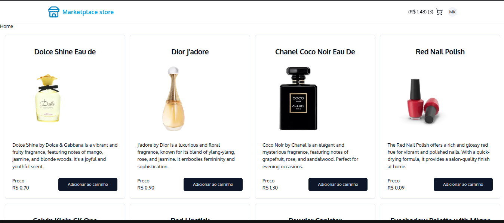
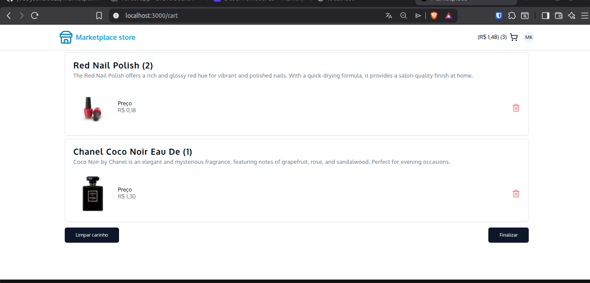

💳 E-commerce moderno com integração de pagamentos (Stripe)

Aplicação de marketplace desenvolvida com foco em performance, experiência do usuário e integração com pagamentos reais, utilizando tecnologias modernas do ecossistema React.

🚀 Demonstração





## 🎯 Objetivo do projeto

Este projeto foi desenvolvido para simular um fluxo real de e-commerce, aplicando conceitos utilizados no mercado como:

- Arquitetura moderna com Next.js (App Router)  
- Gerenciamento de estado de carrinho  
- Integração com gateway de pagamento (Stripe)  
- Componentização e reutilização de UI  
- Boas práticas de frontend escalável  

---

## 🧠 Principais aprendizados

- Integração com APIs externas (Stripe)  
- Organização de projeto com Next.js  
- Uso de bibliotecas modernas para UI acessível (Radix UI)  
- Gerenciamento de estado de forma simples e eficiente  
- Construção de interfaces responsivas e reutilizáveis  

---

## ✨ Funcionalidades

- 📦 Listagem de produtos  
- 🛒 Carrinho de compras dinâmico  
- ➕ Adição e remoção de itens  
- 💳 Simulação de checkout com Stripe  
- 🔔 Feedback visual com Toasts  
- 📱 Layout responsivo  

---

## 🧱 Stack utilizada

- **Framework:** Next.js 16  
- **Linguagem:** TypeScript  
- **UI:** Tailwind CSS + Radix UI  
- **Estado:** use-shopping-cart  
- **Pagamentos:** Stripe  
- **Utilitários:** clsx, tailwind-merge, class-variance-authority  

---

## 🏗️ Decisões técnicas

- Uso do Next.js App Router para melhor organização e escalabilidade  
- Radix UI para garantir acessibilidade e consistência nos componentes  
- use-shopping-cart para simplificar a lógica de carrinho  
- Separação de responsabilidades entre componentes e lógica  

---

## ⚙️ Como rodar o projeto

```bash
git clone https://github.com/joabysonSouza/marketplace-store.git
cd marketplace-store
npm install
npm run dev

Acesse:
👉 http://localhost:3000

🔐 Variáveis de ambiente

Crie um .env.local:

NEXT_PUBLIC_STRIPE_PUBLIC_KEY=your_key_here
📈 Possíveis evoluções
Backend com Node.js ou Firebase
Autenticação de usuários
Persistência de pedidos
Integração completa com Stripe (checkout seguro)
Painel administrativo
💼 Por que esse projeto é relevante?

Este projeto demonstra na prática:

Capacidade de trabalhar com tecnologias modernas do mercado
Conhecimento de fluxos reais de produto (e-commerce)
Integração com serviços externos (pagamentos)
Organização e clareza no código
👨‍💻 Autor

Joabyson Souza
🔗 GitHub: https://github.com/joabysonSouza

